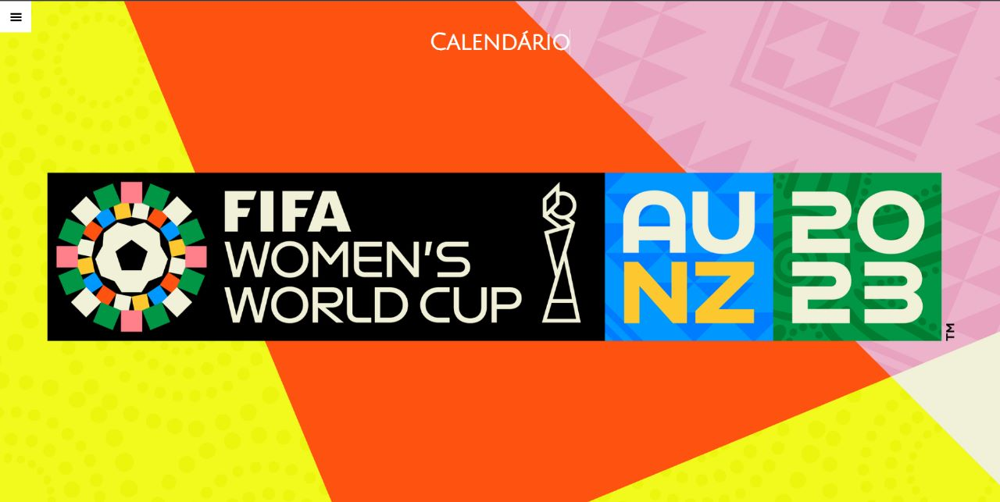
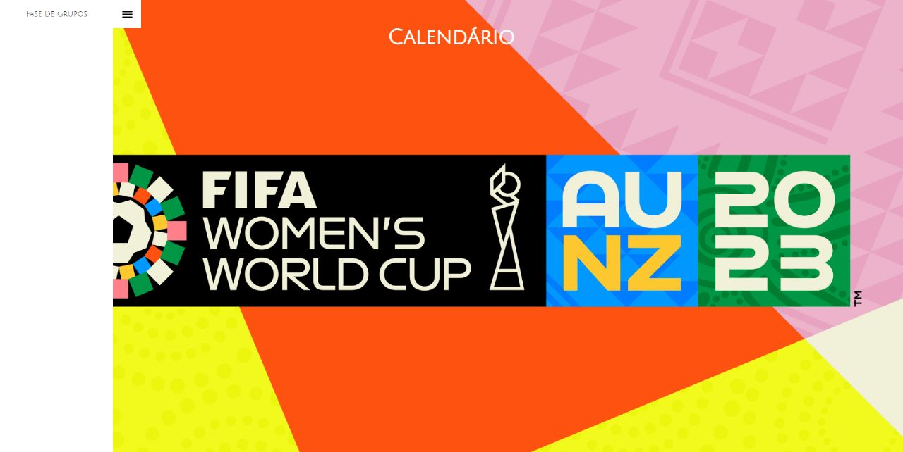
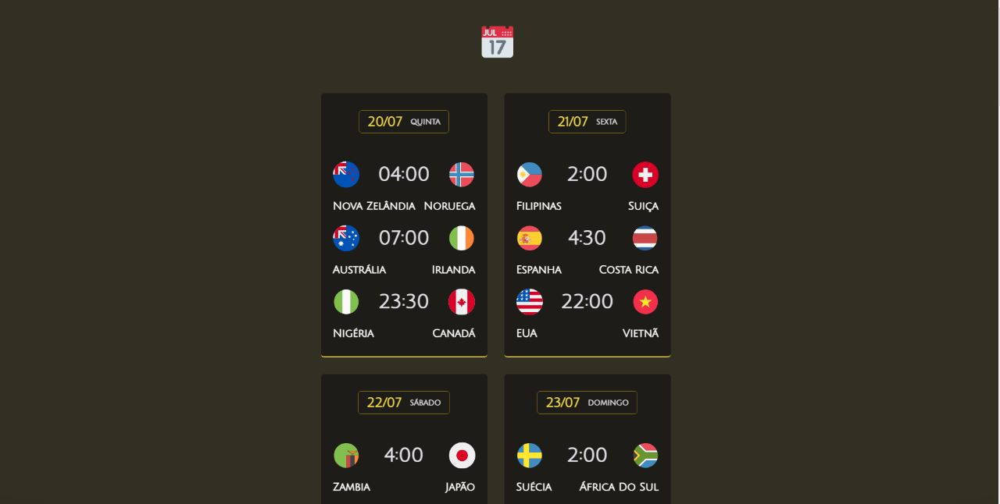

# Fifa Women's World Cup 2023

> Explorer

Projeto construído para acompanhar a Copa do Mundo Feminina 2023!

[ 🔗 Clique aqui para acessar](https://projeto-womens-cup.vercel.app/)

## 🚀 Tecnologias

- HTML
- CSS
- Javascript
- Git e Github

## 💻 Projeto

O projeto Copa é um calendário onde é possível ver os dias e horários dos jogos da Copa Do Mundo Feminina 2023. Foi implementado um menu responsivo que manda para a página do calendário em si e também foram adicionados todos os jogos da fase de grupos.

# 💛 Contato

Email: jonhy.willy.jw71@gmail.com  
Linkedin: https://www.linkedin.com/in/jonhy-willy-57b1051a4/

Feito com ♥ by Jonhy
